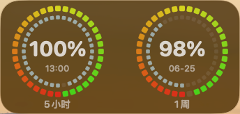

# Codex Usage Dashboard

一个 macOS 桌面 Widget，用来显示本机 Codex 的 5 小时额度和 1 周额度剩余比例。

> Unofficial project. This is not affiliated with OpenAI.



## 功能

- macOS 中号 Widget：双环显示 5 小时 / 1 周剩余额度。
- 宿主 App：后台读取额度，写入共享快照给 Widget。
- 没有任何可读数据时：Widget 显示满环 + `??`，避免误显示 `100%`。
- 数据旧了以后：低频请求 Codex 客户端同源的 usage 接口补一次，不高频轮询。

## 下载使用

1. 到 GitHub Releases 下载 `CodexUsageDashboard.app.zip`。
2. 解压后把 `CodexQuotaDesktop.app` 放到 `/Applications`。
3. 打开 App，保持宿主 App 在后台运行。
4. 在 macOS 桌面添加 Widget，选择 `Codex 剩余额度` 的中号组件。

如果 macOS 提示无法打开未验证 App，需要到系统设置里手动允许打开。这个 Release 包未做 notarization。

## 数据来源

宿主 App 优先读取本机 Codex 数据：

- `~/.codex/sqlite/logs_2.sqlite`
- `~/.codex/sqlite/state_5.sqlite`
- `~/.codex/sessions/**/rollout-*.jsonl`

读取不到新数据时，会低频请求：

- `https://chatgpt.com/backend-api/wham/usage`

请求使用 `~/.codex/auth.json` 里的 access token。只读取顶层 `rate_limit.primary_window` 和 `rate_limit.secondary_window`，不读取模型线路额度。

## 构建环境

- macOS，作者本机 Xcode SDK：macOS 26.5
- Deployment Target：macOS 14.0
- Swift：6.0
- Swift tools：6.3
- Xcode 工程：`CodexQuotaDesktop.xcodeproj`
- App Bundle ID：`com.example.CodexUsageDashboard`
- Widget Bundle ID：`com.example.CodexUsageDashboard.widget`
- App Group：`group.com.example.codexusagedashboard`
- Development Team：留空；fork 后按自己的 Apple Developer Team 设置

如果你 fork 后自己编译，大概率需要改：

- `DEVELOPMENT_TEAM`
- Bundle ID
- App Group
- App / Widget entitlements

这些都和我的 Apple Developer 账号环境绑定。别人机器签名失败时，优先检查这几项。

## 本地构建

验证共享逻辑：

```bash
swift run CodexQuotaWidgetVerification
```

Debug 编译：

```bash
xcodebuild -project CodexQuotaDesktop.xcodeproj \
  -scheme CodexQuotaDesktop \
  -configuration Debug \
  CODE_SIGNING_ALLOWED=NO \
  build -quiet
```

Release 编译：

```bash
xcodebuild -project CodexQuotaDesktop.xcodeproj \
  -scheme CodexQuotaDesktop \
  -configuration Release \
  build -quiet
```

打包 Release zip：

```bash
mkdir -p dist
APP_DIR=$(xcodebuild -project CodexQuotaDesktop.xcodeproj \
  -scheme CodexQuotaDesktop \
  -configuration Release \
  -showBuildSettings | awk -F= '/BUILT_PRODUCTS_DIR/ {gsub(/^ +| +$/, "", $2); print $2; exit}')

ditto -c -k --keepParent \
  "$APP_DIR/CodexQuotaDesktop.app" \
  dist/CodexUsageDashboard.app.zip
```

## 项目结构

- `App/`：宿主 App。
- `Widget/`：WidgetKit 扩展。
- `Sources/CodexQuotaWidget/`：共享数据模型、快照构建、SQLite 读取。
- `Sources/CodexQuotaWidgetVerification/`：无测试框架的最小验证程序。
- `PROJECT_NOTES.md`：项目开发记录和踩坑 notes。

## License

MIT
